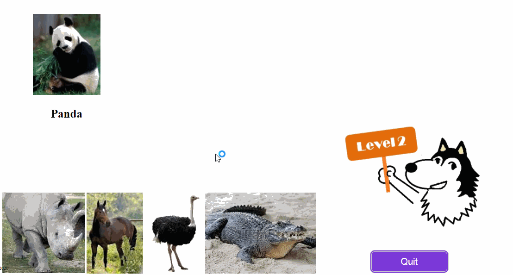

#Animal Shi-ri-to-ri

###Table of Contents
####- Introduction
####- How to play
####- Technologies
####- Setup
####- Environment
####- Status

##Introduction
This is a word game called Shi-ri-to-ri in Japanese. It is intended for seniors and young children to have fun and exercise their brains at the same time.
Although it is a word game, the players will see only photos. The game is simple but still promotes cognitive activities.

##How to play
Place the animal names in such an order that the name starts with the last letter of the previous animal name.
For example, if the previous animal is a "panda", the next will be an animal that starts with "a" such as an "alligator".
It is simple, but you will see only animal photos, not their names.

There are 5 levels and 3 patterns each. You have 243 ways of completing the game. The instruction page can be opened from the home page and left it open during the play.

(All photos used in this game are royalty free photos.)

##Technologies
The languages used:
 - HTML
 - CSS
 - JavaScript

##Setup
1. Unzip the project.zip file and save all the files in C:\inetpub\wwwroot.
2. Open a web browser and type http://localhost/home.html in URL to open the home page.

##Environment
Chrome is recommended.
JavaScript needs to be enabled to use Internet Explorer/Microsoft Edge.

##Status
The next step will be to
- connect to a database,
- add more patterns to each level,
- create a Japanese version, and
- publish the game in a website.

The final step will be to utilize AI to make the game more interactive.

